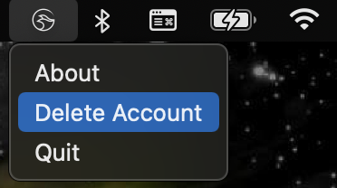

# manta-signer

`manta-signer` is manta's native client that **turbo charges** zero-knowledge-proof generation.

<p align="center">
    
</p>

:warning: **Disclaimer: `manta-signer` is experimental software, use it at your own risk.**

## Project Organization

- `src`: `manta-signer` ZKP generation
- `ui`: `manta-signer` Desktop UI
- `js`: external Javascript libraries that interact with `manta-signer`

## Deleting Your Account

To delete your private account data completely and set up a new account, open manta-signer on the task bar, select 'Delete Account' and confirm that you would like to delete your account in the pop-up window. 

<p align="center">
    
</p>

<p align="center">
    
</p>

Alternatively, you can achieve the same result by removing these files:

- macOS: `~/Library/Application Support/manta-signer/`
- Linux: `~/.config/manta-signer/`
- Windows: `~/AppData/Roaming/manta-signer/`

## Development
### Building
In main directory or ./ui

:warning: **Warning: May not build properly with Node version >17**
```
cargo install
cargo install tauri-cli
cargo tauri build
```
Executables can be found in ./target/release or ./ui/src-tauri/target/release.

### Testing
Can use non-UI testing server in ./examples
```cargo run --example test_server --features=unsafe-disable-cors --release```
```--features=unsafe-disable-cors``` use only if you are using the local manta-front-end
